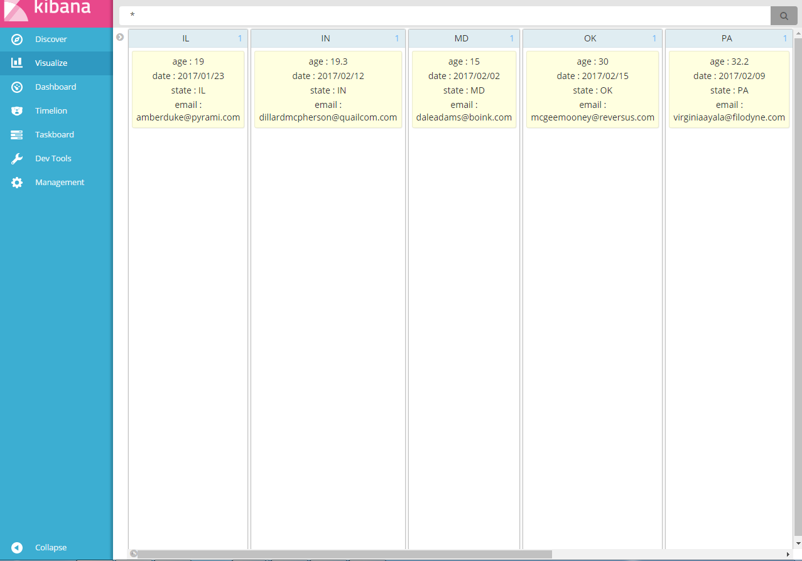
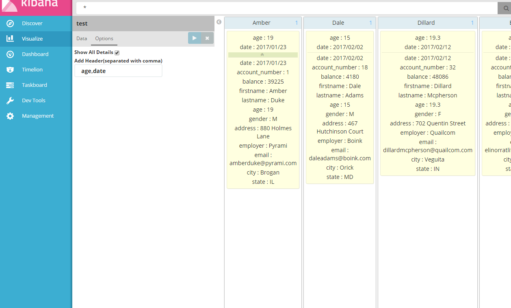
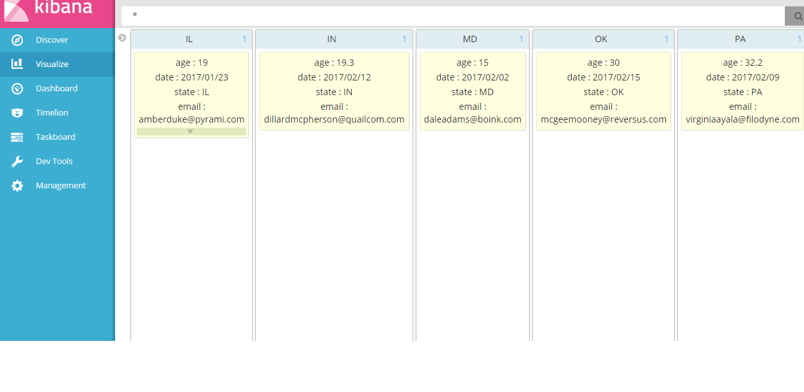

# Kanban
A kibana plugin for displaying data by status(or other key).

Introduction
-------------
This is a plugin for Kibana5+. Has been developed and tested on Kibana 5.1.2 and 5.2.2 version.



### Alert
* If your kibana version is not 5.2.2, please change to your kibana version in package.json.
* This plugin need to modify self.searchSource.size() to self.searchSource.size(300) in \_saved_vis.js (there's a better way to do this, will improve in the future).

### Usage
Installation:
```
$ cd KIBANA_HOME/plugins
$ git clone https://github.com/Echolee-L/kanban_vis.git
```
Here are some screenshots.





