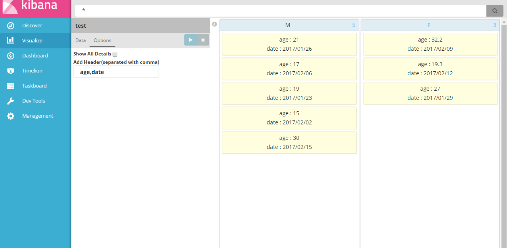

# Kanban
A kibana plugin for displaying data by status(or other key).

Introduction
-------------
This is a plugin for Kibana5+. Has been developed and tested on Kibana 5.1.2 and 5.2.2 version.


### Usage
Installation:
```
$ cd KIBANA_HOME/plugins
$ git clone https://github.com/Echolee-L/kanban_vis.git
```
Here are some screenshots.




